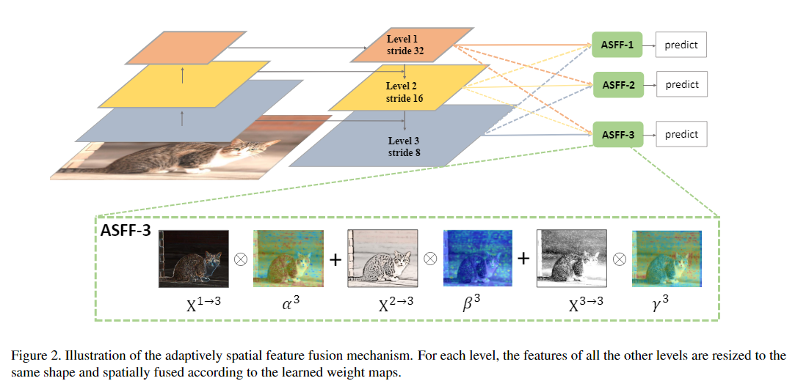

# 工作内容记录

| Time |           key-point           |                            Detail                            | Progress |
| :--: | :---------------------------: | :----------------------------------------------------------: | :------: |
| 1003 | 构建backbone、neck、yoloxhead | 修正完成backbone、neck、yoloxhead的model_size输出，并构建完成建立模型的过程，yoloxhead中包括了yolox loss计算，backbone包括darknet、cspdarknet，head主要包括了两种解耦方式的检测头 |    ✅     |
| 1004 |            完成exp            |           构建每个训练任务的模板，包括数据，模型等           |    ✅     |
| 1005 | 修正fpn为输入输出的通道数相同 |  均使用相同的model_size参数同一构建backbone、neck、head模块  |    ✅     |
| 1007 |           Trainer类           |                实现每个定义好的exp的训练过程                 |    ✅     |
| 1014 |              DDP              |                       实现单机多卡训练                       |    ✅     |
| 1015 |   测试基于DIOR&nano版本代码   | 1007下午被挤掉 1008重新开始 任务内容记录在train_log.txt，目前已完成train和val |    ✅     |
| 1020 |           shell运行           |                  可以直接使用命令行运行代码                  |    ✅     |
| 1028 |              vit              |                                                              |          |
| 1104 |              CAM              |                      生成yolox的热力图                       |    ✅     |

# Plan

### Backbone

| Progress |   model    |             model_size              | Detail | Time |
| :------: | :--------: | :---------------------------------: | :----: | :--: |
|    ✅     |  darknet   |               21、53                |        | 1003 |
|    ✅     | cspdarknet |            n、s、m、l、x            |        | 1003 |
|    ✅     |   resnet   | res18、res34、res50、res101、res152 |        | 1010 |
|          |    vgg     |                                     |        |      |
|          |  convnext  |                                     |        |      |
|          |    vit     |                                     |        |      |
|   ✅     |   repVGG   |                                     |        | 1021 |


### Neck

本项目中实现的neck中的涉及到的每个layer的block数目都默认与backbone中第层中的block数目相同

| Progress |                            model                             |      Detail       | Time |
| :------: | :----------------------------------------------------------: | :---------------: | :--: |
|    ✅     |                             FPN                              |                   | 1003 |
|    ✅     |                             PAN                              |                   | 1003 |
|    ✅     |                             SCA                              |  自己使用的模块   | 1024 |
|    ✅     | [ASFF](https://click.endnote.com/viewer?doi=10.48550%2Farxiv.1911.09516&token=WzM0MDI0NjUsIjEwLjQ4NTUwL2FyeGl2LjE5MTEuMDk1MTYiXQ.abCZpFILssJmEMgwK2wYLBnvoBw): [code](https://blog.csdn.net/weixin_45679938/article/details/122354725) | [模型结构](#ASFF) |      |

### Head

| Progress |   model   |               Detail                | Time |
| :------: | :-------: | :---------------------------------: | :--: |
|    ✅     | Decoupled | 在YOLOX中的+修改的Feature Align方式 | 1003 |

## Label Assign

| Progress | model  |   Detail    | Time |
| :------: | :----: | :---------: | :--: |
|    ✅     | simOTA | YOLOX中使用 | 1007 |
|          |  ATSS  |             |      |
|          |  TOOD  |             |      |

## Demo

| Progress | 任务项 |     Detail     | Time |
| :------: | :----: | :------------: | :--: |
|    ✅     |  CAM   | 就行模型可视化 | 1104 |

# start

```shell
# install
python setup.py develop

# train
python yolori.tools.train -n asff_dior_n -b 256 -o --cache 

# get cam 
python yolori.tools.eigercam.py -n asff_dior_n -i ../imgs/21212.jpg  # save cam in ../imgs default
```


## Other

##### Linux

```shell
w：# 显示登录的用户及其当前执行的任务
who：# 显示当前当登录的用户的信息
last：# 显示当前与过去登录系统的用户的信息
users：# 显示当前当登录的用户的用户名
netstat # 端口占用
```

##### **visdom**

```shell
# 1、ssh重定向到本地
ssh -L 18097:127.0.0.1:8097 username@ip
# 2、在服务器上使用指定端口正常启动visdom：	
python -m visdom.server -p 使用端口号
# 3、本地浏览器输入输入地址。
http://localhost:18097
```

##### [tensorboard](https://blog.csdn.net/weixin_35653315/article/details/71327740)

```shell
# 1、ssh重定向到本地
ssh -L 16006:127.0.0.1:6006 username@remote_server_ip

# 2、在服务器上使用6006端口正常启动tensorboard：	
tensorboard --logdir=xxx --port=6006

# 3、在本地浏览器中输入地址：
127.0.0.1:16006
```

##### [git](https://www.jianshu.com/p/3c35c3ecca7b)

```shell
git rm --cached file  # delete cached  ----.gitignore
```


# error

1、AttributeError:module ‘distutils’ has no attribute 'version’

```shell
pip install --upgrade setuptools==56.1.0
```

2、can't find 'yolori' module

```shell
cd YOLORI-base-v1 
python setup.py develop
```

# model framework

## ASFF
